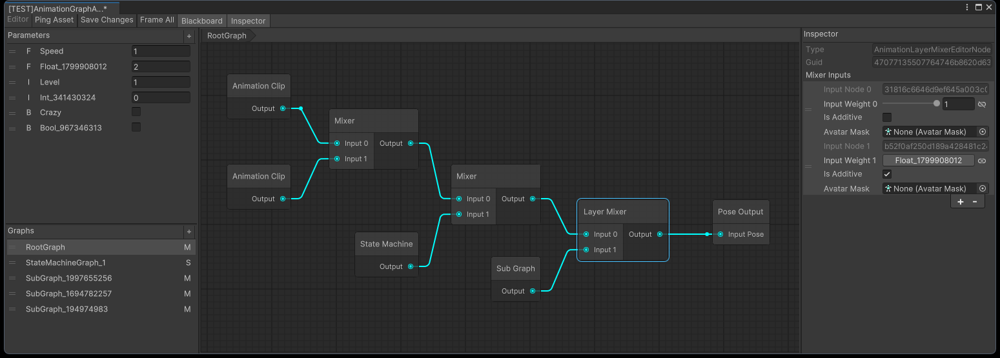
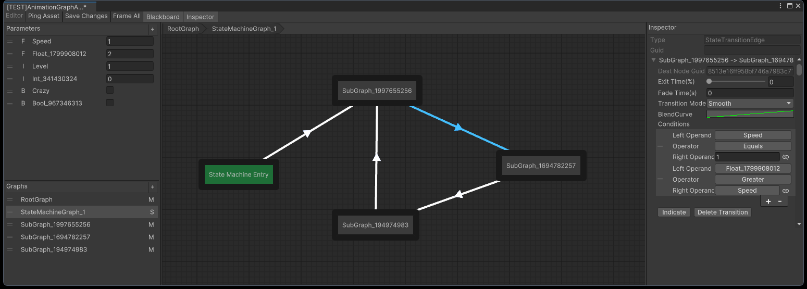

# Puppeteer

A graph based animation controller for Unity.

**IMPORTANT NOTICE:** The code design in this repository has some flaws, which prevent it from fully implementing certain functionalities (such as multi-layer state machines). You can reference the design ideas in this repository, but do not use this repository directly in a development environment.

**ADDENDUM:** Although the code design in this repository failed, in my subsequent development, I have proven that using Playable to implement a graph-based animation system is feasible, but I am unable to open-source it. Additionally, I **do not recommend** using Playable to build a large-scale, graph-based animation system, as Playable was not designed for complex topological structures, and it has quite a few limitations, reference(written in Chinese):
- [Animation Playable Bug、限制及解决方案汇总](https://zhuanlan.zhihu.com/p/631392835)
- [Playable使用细则](https://zhuanlan.zhihu.com/p/632890306)
- [动画图插件的开发总结](https://zhuanlan.zhihu.com/p/601926796)

 

 

## Status

Legends:
- 󠀥✅ Completed
- ▶️ In Progress
- ❔ Undetermined
- 🔘 Canceled
- 🚫 Won't Support

### Animation Graph Editor

- Nodes
    - ✅ Pose Output Node(Graph Root Node)
    - ✅ Mixer Node
    - ✅ Layer Mixer Node
    - ✅ Clip Node
        - ✅ Optional Playback Speed
        - ✅ Optional Motion Time
    - ▶️ Blend Space 1D Node
    - ▶️ Blend Space 2D Node
    - ✅ Animation Script Node
    - ✅ Script Node
    - ✅ Sub Graph Node
    - ▶️ State Machine Node
    - ▶️ State Node(In State Machine)
    - 🔘 ~~Param Node~~ (Embed into PlayableNode)
    - 🚫 Pose Cache Node
    - 🚫 Mirror Pose Node
- State Machine
    - ▶️ Transition
        - Smooth Transition
        - Frozen Transition
- ❔ Light Theme UI
- ❔ Pose Preview
- ❔ Debug Mode

### Animation Graph Runtime

- Nodes
    - ✅ Clip Node
        - ✅ Optional Playback Speed
        - ✅ Optional Motion Time
    - ✅ Mixer Node
    - ✅ Layer Mixer Node
    - ▶️ Blend Space 1D Node
    - ▶️ Blend Space 2D Node
    - ✅ Animation Script Node
    - ✅ Script Node
    - ✅ Sub Graph Node
    - ▶️ State Machine Node
    - ▶️ State Node(In State Machine)
    - 🔘 ~~Param Node~~ (Embed into PlayableNode)
    - 🚫 Pose Cache Node
    - 🚫 Mirror Pose Node
- Runtime PlayableGraph Modification
    - ❔ Clip Replacement
    - ❔ BlendSpace1D Replacement
    - ❔ BlendSpace2D Replacement
    - ❔ SubGraph Replacement
- Events
    - ❔ Playable State Events
    - ❔ Custom Events

### Others

- ❔ IK
- ❔ Ragdoll
- ❔ Pose Matching
